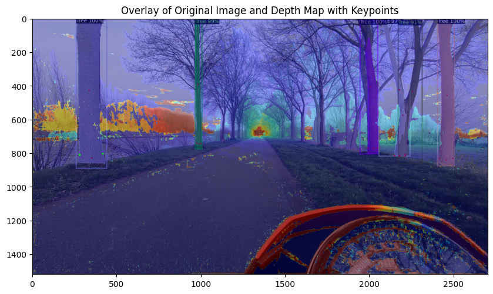
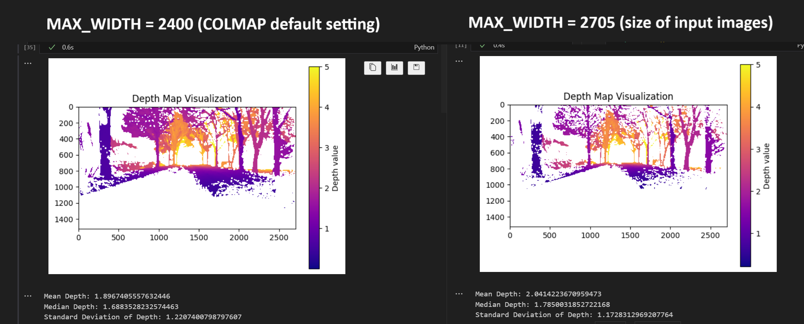
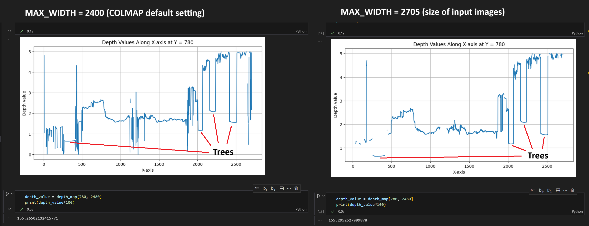

# Docs COLMAP

Alles wat hier inkomt is ook al meteen gebruiksklaar maken voor in onze paper.

Data used here can be found in the shared onedrive folder.

## Points in sparse and dense model are plotted on the same x,y,z axis

(Zelfde assenstelsel)

? Points found in sparse model are also found in dense model. (Ik denk van wel maar nog niet 100% zeker moet overlap testen in python.)


Sparse model with coordinates of a selected point:  
`-0.673285, 0.433945, -1.83049`


Dense model with coordinates of a closely located selected point:  
`-0.677054, 0.414289, -1.84333`


### Extra example


## Depth image, different size than original 2D input image

This is no problem, after resizing to original 2D input image size and overlapping the images it is clear that there is a perfect overlap.



```python
import cv2
import numpy as np
import matplotlib.pyplot as plt

# Load the original 2D image and the depth map
original_image = cv2.imread('eastbound_20240319_07851.png')

# Resize the depth map to match the dimensions of the original image
# depth_map_resized = cv2.resize(depth_map, (original_image.shape[1], original_image.shape[0]))
depth_map_resized = cv2.resize(depth_map, (original_image.shape[1], original_image.shape[0]), interpolation=cv2.INTER_NEAREST)

# Normalize the depth map for visualization (optional)
depth_map_normalized = cv2.normalize(depth_map_resized, None, 0, 255, cv2.NORM_MINMAX)
depth_map_normalized = depth_map_normalized.astype(np.uint8)

# Convert depth map to a color map
depth_map_colored = cv2.applyColorMap(depth_map_normalized, cv2.COLORMAP_JET)

# Overlay the depth map onto the original image
overlay = cv2.addWeighted(original_image, 0.6, depth_map_colored, 0.4, 0)

# Define keypoints (example coordinates)
left_point = (281, 811)
right_point = (418, 805)
keypoints = [
    left_point,
    right_point
]

# Add keypoints to the overlay image
for point in keypoints:
    cv2.circle(overlay, point, 5, (0, 255, 0), -1)

# Convert BGR image to RGB for displaying with matplotlib
overlay_rgb = cv2.cvtColor(overlay, cv2.COLOR_BGR2RGB)

# Display the overlay image with keypoints
plt.figure(figsize=(10, 10))
plt.imshow(overlay_rgb)
plt.title('Overlay of Original Image and Depth Map with Keypoints')
# plt.axis('off')
plt.show()


# Visualize the depth map
plt.figure(figsize=(13, 10))
plt.imshow(depth_map)
plt.colorbar(label='Depth')
plt.title("Depth Map")
plt.xlabel('X-axis')
plt.ylabel('Y-axis')
plt.show()
```

## Depth images of differnt sizes, depth always stays the same






When using different max_width sizes for the depth maps the results were similar. The larger max_width (b) resulted in an images with more noise and gaps. The smaller max_width (a) had smoother tree surfaces and seemed to generalize better. The depth were both resized to the original 2D input image size. After that it can be seen that the depth of the same point on depth map (a) and (b) is very similar. There was only a small error margin of 0.0003 units.
