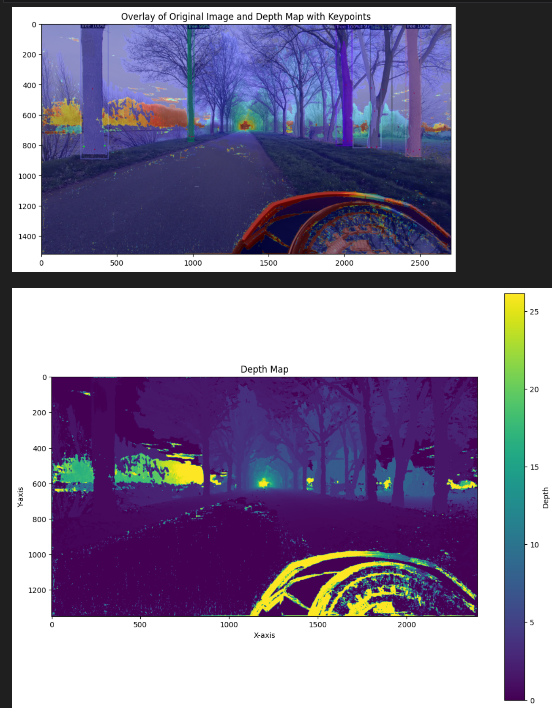
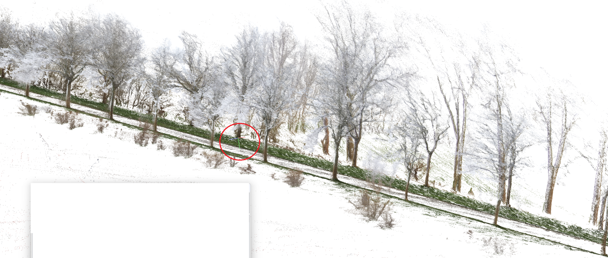

# pseudocode

READ carefully, ask questions when in doubt!

keypoints => rode punten op de geannoteerde bomen => treepoints
keypoints in COLMAP => punten die gebruikt zijn als referentie punt om 3D reconstructie mee te maken => refpoints

felling cut = onderste punt dichtste bij de camera (midden onderaan de boom)

center keypoints around first camera pose

```

manually detect units per meter (can be done on depth images)
use a single road with estimation in one of the images to go from a scale in units to meters
we know that the road is 4 meters along the entire track
take the amount of units that the road is wide and divede by 4
units_per_meter = value obtained from workflow here above
multiple calibration measurements if possible

intilize list of trees
- id
- best_3d_coords (x,y,z)
- average_3d_coords (x,y,z)
- best_score
- best_diameter in units
- best_diameter in meters
- average_diameter in units
- average_diameter in meters
- all_detections: Array (tree was detected, e.g. in frame 0851 and 0856 and 0859)
    - 3d_coords (x,y,z)
    - score
    - diameter in units
    - diameter in meters
- detection_count : int  (len(all_detections))

foreach json:
    foreach detected tree in json:
        if score < 85%:
            continue
        if overlap with other trees:
            continue
        match treepoint [felling cut] from 2D image to 3D refpoint:
            you have a list of 2D refpoints
            use only the 2D refpoints that are linked with a 3D refpoints
                this can be done with a simple 
                    if keypoint3d != -1
            take the refpoint that is closest to the treepoint [felling cut OF middle point] in 2D and has a linked 3D refpoint (this is just the keypoint3d ID)

            Draw sphere of 1.5 meters around the 3d point
            IF the linked 3D refpoint falls within the sphere => we have a duplicate detection of the same tree
            We will still add this to our tree list (this gives us the option to get an average tree diamater and coords later)
                Add linked 3D refpoint to all_detections
                Also add score to all_detections
                Get diameter from depth map and add to all_detections
                    depth map has same image name as original 2d image but needs to be resized
                    then find 2d points in depthmap and calculate size in units
                    divide by units per meter => this parameter is shown above
                    store diameter in units
                    store diameter in meters
            Use the score to determine which detection from all_detections is best and put this in 
            - best_3d_coords (x,y,z)
            - best_score
            - best_diameter in units
            - best_diameter in meters
            Update 
            - average_3d_coords (with some middlepoint of the cluster)
            - average_diameter in units
            - average_diameter in meters


```

Remarks

(1) Making the dense map, and depth images causes the image to resize from:

- Original dimensions: 2704×1520
- New dimensions: 2659×1494

This is because the undistort step (which is mandatory, no other way around it) shrinks the images a bit
To avoid that keypoints are not mapped corretly the depth image is resized to the original size
When overlapping both images, it seems like the image was indeed resized and not cropped. The green keypoints were manualy added on top and landed right above the original red ones, so the scaling seems to be alright.



(2) Depth image is already better than sparse model, dense model has no mapping from 2d to 3d, only 3d points without knowing the original corresponding 2d point

(3) The depth images are still not perfect, sometimes when taking the most left and right treepoint (tree keypoint), the depth images show a point very far away. That's why it is a good idea to check the points in between the most left and right point to see if the distance is similar.
An alternative method could be using the depth to the middle point of the tree and then the distance from left to right using that depth of the middle point

(4) allign the 3d coords xyz axis with the start postion of the first camera
this will be easier to map the 3d coords to a 2d top down map of the trees



(optional) since we know the tree width, the top down map can have circles with the actual size (diameter) of the tree trunk
